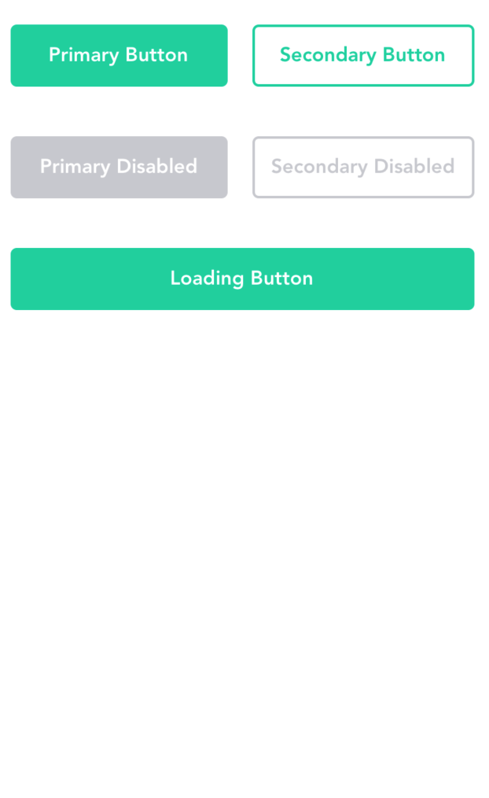
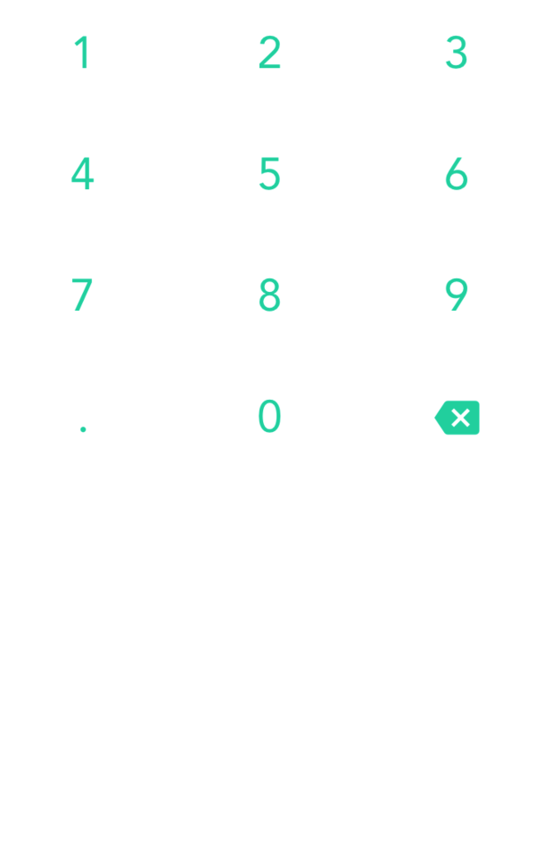
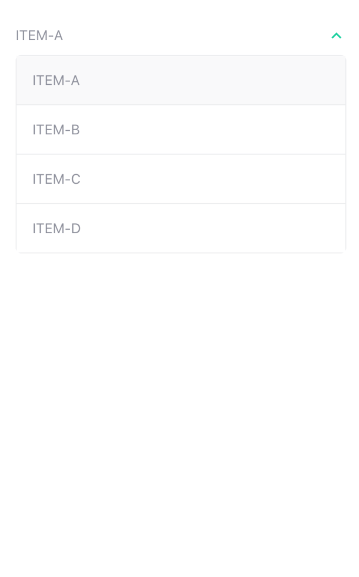
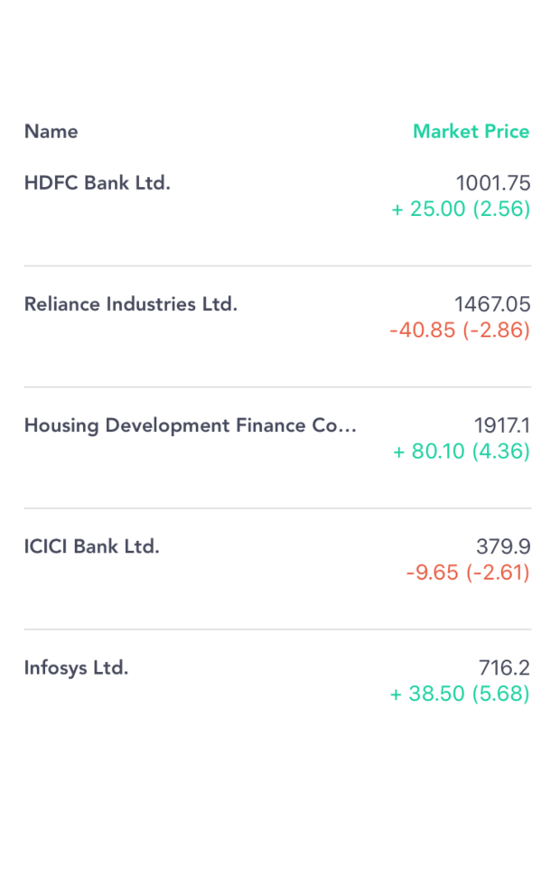

# Overview

Viserion is a collection of common ui components developed and designed by Groww Engineering Team,which aims to give you all set of most commonly used ui components or helpers at a single place,so that you could only worry about writing the business logic of your app.

# Preview

Below screenshots are some previews of the components which resides in this ui-kit,it is just for demoonstration purposes,the kit contains many more components and helper methods.

  

# Installation

Follow this [link](https://groww.github.io/viserion/docs/getting-started) to setup viserion into you project.

> The library is still under development & we are working to ship more usefull components very soon,below are some components which seems stable to use for now.

# Requirements

Few of our components depends on external libraries to perform well,for example [Checkbox](https://groww.github.io/viserion/docs/checkbox),it depends on [react-native-vector-icons](https://www.npmjs.com/package/react-native-vector-icons) to render icons inside the box,so please make sure you already have this package installed and linked properly to you react-native project.

We assume it best perform on `react-native` greater than `v0.60`,we have not tested below to that version,if you are on lower versions of react and facing any issue,you can file and issue [here](https://github.com/Groww/viserion/issues/new)

## Components

1. [Button](https://groww.github.io/viserion/docs/button)
2. [Checkbox](https://groww.github.io/viserion/docs/checkbox)
3. [NumPad](https://groww.github.io/viserion/docs/numpad)
4. [Radiobutton](https://groww.github.io/viserion/docs/checkbox)
5. [Table](https://groww.github.io/viserion/docs/table)
6. [EmptyView](https://groww.github.io/viserion/docs/emptyview)
7. [Switch](https://groww.github.io/viserion/docs/switch)
8. [Dropdown](https://groww.github.io/viserion/docs/dropdown)
9. [Input](https://groww.github.io/viserion/docs/input)

